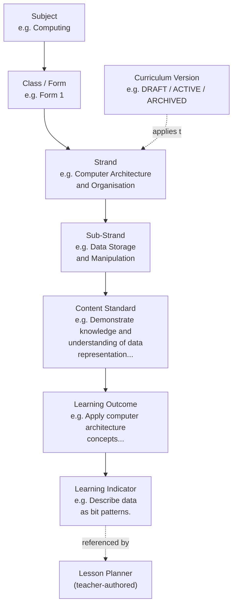

# 10, 19. Ghana Curriculum Architecture and Curriculum Data Management

[← Back to documentation home](README.md)

## 10. Ghana Curriculum Architecture

### The hierarchy

The curriculum is modelled as seven levels, each a distinct database table (see [07-database-design.md](07-database-design.md) for the full schema). This is the single authoritative structure the entire application is built around — a lesson planner never stores curriculum text directly; it only ever references a `LearningIndicator` row by id.

**Purpose of each entity:**

| Entity | Purpose |
|---|---|
| **Subject** | A taught subject, e.g. Computing. Has a unique `code` (short identifier, e.g. `COMP`) and a unique `name`. |
| **Class/Form (`ClassLevel`)** | A grade/form level, e.g. Form 1. Has a unique `name` and a unique `sequence` (used for ordering). |
| **Curriculum Version (`CurriculumVersion`)** | A named release of curriculum content (e.g. a particular syllabus edition), with a lifecycle status: `DRAFT`, `ACTIVE`, or `ARCHIVED`. Every `Strand` belongs to exactly one version. |
| **Strand** | A broad content area within a Subject/Class, e.g. "Computer Architecture and Organisation". Belongs to one Subject, one Class Level, and one Curriculum Version simultaneously. |
| **Sub-Strand** | A narrower topic within a Strand, e.g. "Data Storage and Manipulation". |
| **Content Standard** | A statement of what learners should know/understand within a Sub-Strand. |
| **Learning Outcome** | A specific, assessable outcome expected from a Content Standard. |
| **Learning Indicator** | The most granular curriculum statement — the specific, observable thing a learner should be able to do. This is the level a `LessonPlanner` actually references. |

### How curriculum selection works (dependent selection)

The planner wizard's Step 2 presents five selects in strict sequence: Strand → Sub-Strand → Content Standard → Learning Outcome → Learning Indicator (Subject and Class are chosen in Step 1). Each select is populated by a request scoped to its parent's id (e.g. `GET /api/curriculum/sub-strands?strandId=...`) and is disabled with a "select X first" message until its parent has a value. This is enforced in the UI (`CurriculumSelectField.tsx`) and independently in the API (each teacher-facing curriculum route requires a real parent id and returns `404` for an unknown one, or `200` with an empty array for a valid parent with no children yet — these two cases are deliberately distinguished).

### Curriculum integrity rules

- **Uniqueness.** `Subject.code`, `Subject.name`, `ClassLevel.name`, `ClassLevel.sequence`, `CurriculumVersion.name`, and the `code` field on `Strand`/`SubStrand`/`ContentStandard`/`LearningIndicator` (where set) are all database-unique. `LearningOutcome` has no code — its identity is its position (parent + `sequence`).
- **Referential integrity.** Every child row's foreign key is enforced by Postgres. Deleting a `Subject`, `ClassLevel`, or `CurriculumVersion` that still has `Strand` rows is blocked (`onDelete: Restrict`). Deleting a `Strand`/`SubStrand`/`ContentStandard`/`LearningOutcome` cascades to its own children (`onDelete: Cascade`) — but the admin UI additionally pre-checks and refuses a delete while children exist, so a cascade is never actually triggered through the application; it exists as a database-level backstop only.
- **Never orphan a planner's reference.** `LessonPlanner.learningIndicator` uses `onDelete: Restrict` — a `LearningIndicator` that is referenced by any lesson planner (draft or published) cannot be deleted, and the admin service pre-checks this with a specific error message ("Cannot delete: N lesson planner(s) reference this indicator").
- **Curriculum data is never duplicated into a planner.** A `LessonPlanner` row stores only `learningIndicatorId` (a foreign key) plus its own planning fields — the curriculum text itself (Strand name, Content Standard wording, etc.) is always read fresh from the curriculum tables when needed (for display, print, or AI context), never copied.

### Curriculum versioning

The `CurriculumVersion` model and its `status` field (`DRAFT`/`ACTIVE`/`ARCHIVED`) exist in the schema and are editable through the admin UI. **This status is currently informational only** — no other part of the application filters or restricts curriculum selection by version status (e.g. a teacher can select a Strand under a `DRAFT` version the same as an `ACTIVE` one). Enforcing version status as a real gate is a documented gap, not a hidden feature — see [17-project-status.md](17-project-status.md).

### Future support for additional subjects

The data model is subject-agnostic by design — nothing in the schema or the import pipeline assumes Computing specifically. Adding a new subject means creating curriculum data (via the admin UI or a CSV/JSON import) under a new `Subject`/`ClassLevel` combination; no code change is required. Only one subject (Computing) and one class level (Form 1) are seeded today (see below).

### Curriculum data vs teacher-created lesson content

This distinction is structural, not just a convention:

| | Curriculum master data | Teacher-authored planning data |
|---|---|---|
| **Tables** | `Subject`, `ClassLevel`, `CurriculumVersion`, `Strand`, `SubStrand`, `ContentStandard`, `LearningOutcome`, `LearningIndicator` | `LessonPlanner`, `Lesson`, `LessonActivity`, `Assessment`, `EssentialQuestion`, `PedagogicalStrategy`, etc. |
| **Who can write** | `CURRICULUM_ADMIN` only | The owning `TEACHER` only |
| **How AI may touch it** | Read-only input to AI (never written by AI) | AI may suggest content here, subject to explicit teacher review |
| **Ownership model** | Global — shared by every teacher | Scoped to one `TeacherProfile` |

---

## 19. Curriculum Data Management

### How curriculum data enters the system

There are three entry points, all ultimately funnelled through the same idempotent write logic:

1. **Seed data (development).** `prisma/seed.ts` runs `npm run db:seed`, which imports a hand-transcribed dataset (`prisma/seed-data/computing-form1.ts`) derived from `docs/lesson plan.docx` — Computing, Form 1: 2 Strands, 4 Sub-Strands, 4 Content Standards, 6 Learning Outcomes, 13 Learning Indicators — plus the 4 cross-cutting themes named in that same reference document and a demo teacher + demo admin account.
2. **Admin UI CRUD.** A `CURRICULUM_ADMIN` can create/edit/delete any node directly through `/admin/curriculum/*`.
3. **CSV/JSON import.** A `CURRICULUM_ADMIN` can upload a file at `/admin/curriculum/import` describing one or more full curriculum trees (Subject through Learning Indicator).

### Curriculum import format

- **JSON**: either one `CurriculumTreeInput` object or an array of them, matching the shape in `src/server/services/curriculum-import/types.ts`.
- **CSV**: one row per Learning Indicator, with a column for every ancestor field (`subjectCode, subjectName, classLevelName, classLevelSequence, curriculumVersionName, curriculumVersionYear, curriculumVersionStatus, strandCode, strandName, strandSequence, subStrandCode, subStrandName, subStrandSequence, contentStandardCode, contentStandardDescription, contentStandardSequence, learningOutcomeDescription, learningOutcomeSequence, learningIndicatorCode, learningIndicatorDescription, learningIndicatorSequence`). All columns except the optional curriculum-version year/status are required on every row; rows sharing the same ancestor values are grouped back into one tree.

### Validation (before any write)

1. **Structural validation** — every required field present, every `sequence` a positive integer (JSON is additionally checked with a Zod schema; CSV rows are checked as they're parsed).
2. **In-file duplicate detection** — the same code used twice with conflicting content (a different name/description/sequence) is a hard error; the same code repeated with identical content (normal in the CSV format, where a code is naturally repeated across sibling rows) is not an error.
3. **Against-database diff** — every node is classified as `create` (code not seen before), `update` (code exists, content differs), or `unchanged` (code exists, content identical). A code that would collide with a *different* existing record (e.g. a Subject name already used by a different Subject code) is a hard error, not a silent overwrite.

### Preview before commit

`POST /api/admin/curriculum/import/preview` runs the full parse → validate → diff pipeline and returns counts (create/update/unchanged per level) plus the full issue list — **without writing anything to the database.** The admin UI shows this before any "Confirm Import" action is available, and disables commit while any error-severity issue remains.

### Commit

`POST /api/admin/curriculum/import/commit` **re-runs the entire pipeline from scratch** — it never trusts a client-held preview — and only then performs the writes, all inside a single Prisma transaction per tree, so a partial import can never be left half-committed. Writes are upserts keyed by each node's stable `code` (or, for `LearningOutcome`, by parent + `sequence`), which is what makes a re-import idempotent.

### Duplicate prevention

Enforced at two layers: the import validator (described above) and, independently, database-level unique constraints on every `code` column that participates in an upsert — so even a bug in the validator cannot result in two rows silently sharing a code.

### Administrator responsibilities

- Keep Subject/Class Level/Curriculum Version metadata accurate.
- Build or import the Strand→Learning Indicator hierarchy for each supported Subject/Class combination.
- Resolve validation errors surfaced by the import preview before committing.
- Understand that deleting a curriculum node is blocked while any planner references it (directly or through a descendant), so an accidental delete cannot silently break existing teachers' plans.

### Protection of official curriculum records

- Every mutating admin operation requires `CURRICULUM_ADMIN` role, checked in the service layer independently of the route (see [10-security-and-privacy.md](10-security-and-privacy.md)).
- AI is never given write access to curriculum data — the AI provider interface has no method that could create or alter a curriculum row (see [09-ai-architecture.md](09-ai-architecture.md)).
- A `LearningIndicator` referenced by any lesson planner cannot be deleted.
