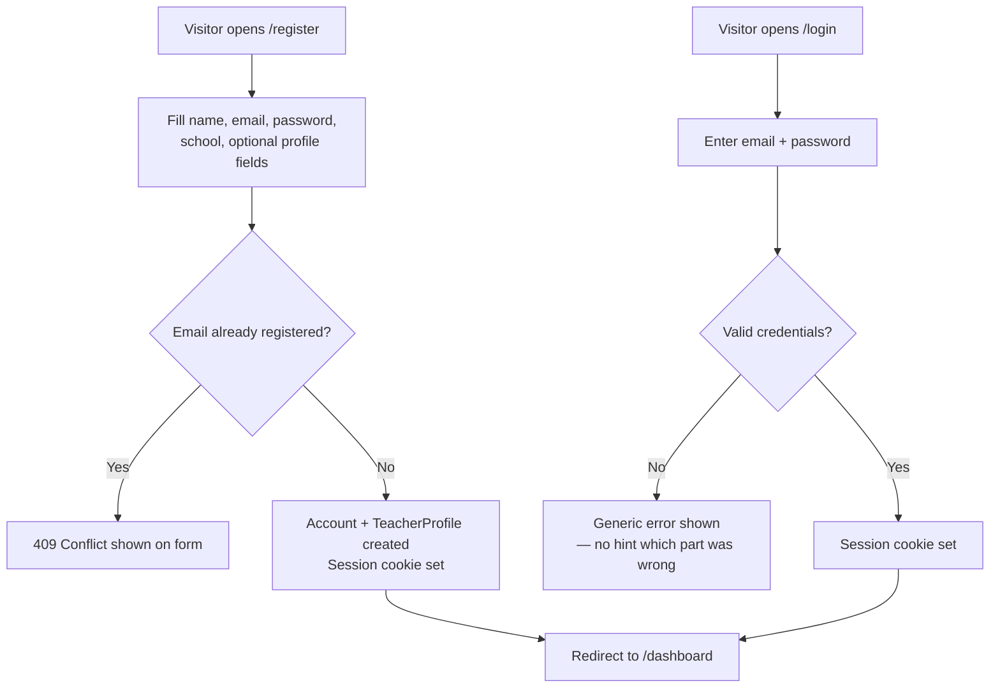
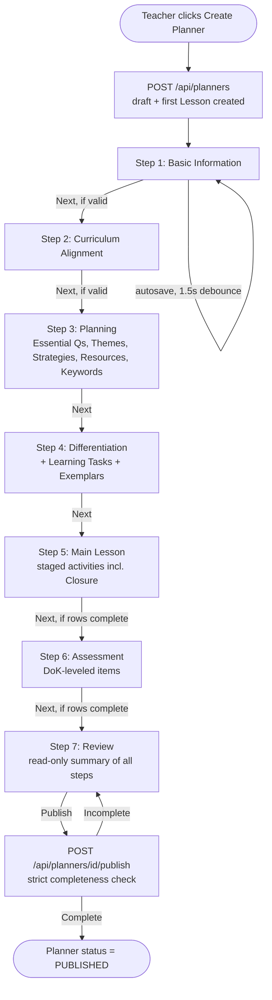
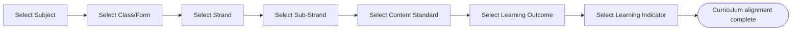
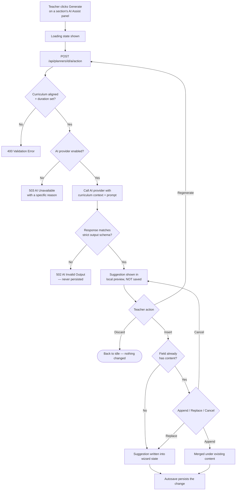
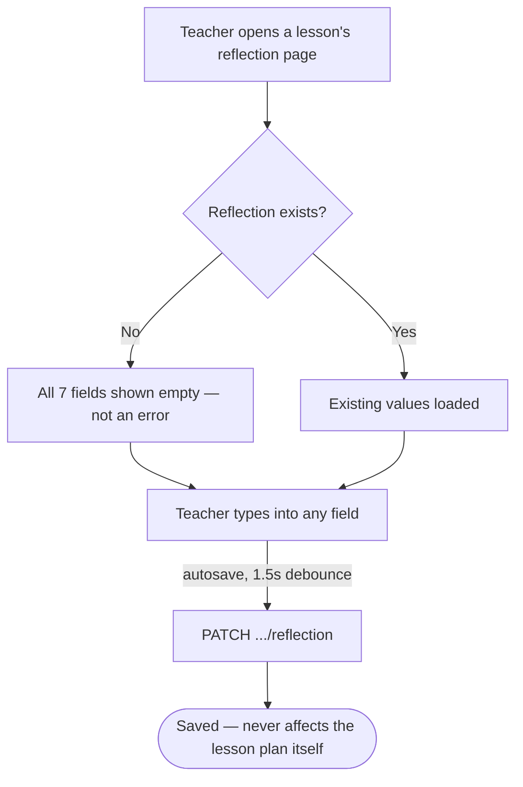
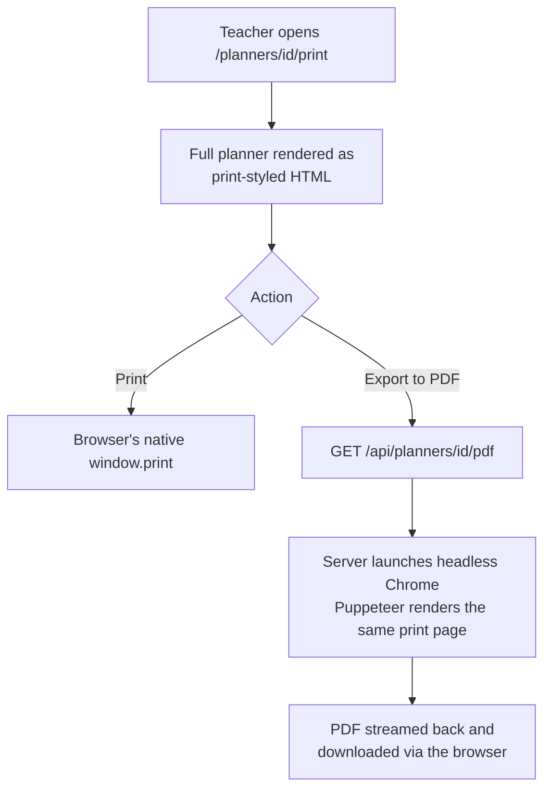
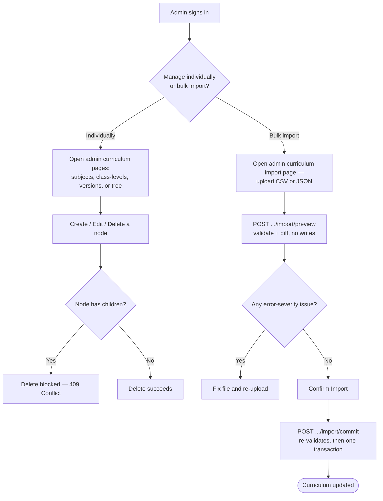

# 11–12. Ghana Learning Planner Structure and User Workflows

[← Back to documentation home](README.md)

## 11. Ghana Learning Planner Structure

The planner structure is derived from two sources: the reference document `docs/lesson plan.docx` (a real, sample Ghanaian "Learning Planner" for Computing, Form 1) and the database schema/wizard that implements it. Terminology below preserves the reference document's own headings.

| Reference section | Where it lives in the app | Implementation |
|---|---|---|
| Subject, Week, Duration, Form, Strand, Sub-Strand, Content Standard, Learning Outcome(s), Learning Indicator(s) | Wizard Step 1 (Basic Information) + Step 2 (Curriculum Alignment) | IMPLEMENTED |
| Essential Question(s) | Wizard Step 3 | IMPLEMENTED |
| Cross-cutting themes (21st Century, GESI, SEL, National Values — named inline in the reference document's essential questions) | Wizard Step 3, as a first-class `CrossCuttingTheme` selection + required per-theme explanation | IMPLEMENTED |
| Pedagogical Strategies | Wizard Step 3 | IMPLEMENTED |
| Teaching & Learning Resources | Wizard Step 3 | IMPLEMENTED |
| Key Notes on Differentiation (i. Learning Task, ii. Pedagogical Exemplars, iii. Key Assessments/DoK) | Split across Step 4 (Differentiation Plan, Learning Tasks, Pedagogical Exemplars) and Step 6 (Assessment/DoK) | IMPLEMENTED |
| Keywords | Wizard Step 3 | IMPLEMENTED |
| Main Lesson (per lesson: Teacher Activity / Learner Activity across Starter, Introductory, Activity N stages) | Wizard Step 5 | IMPLEMENTED |
| Assessment DoK aligned to the Curriculum | Wizard Step 6 | IMPLEMENTED |
| Lesson Closure | A `CLOSURE`-stage row within the same Step 5 activity list (not a separate reference-document-style block) | IMPLEMENTED |
| Reflection & Remarks | A separate page per lesson (`/planners/[plannerId]/lessons/[lessonId]`), completed after teaching | IMPLEMENTED |

### Field-by-field explanation

**Basic Information** — Subject, Class/Form, Term, Week Number, Lesson Number, Date (optional), Duration (minutes). Anchors everything else; duration is later used to proportion AI-suggested activity timing.

**Curriculum Alignment** — the five cascading selects (Strand → Sub-Strand → Content Standard → Learning Outcome → Learning Indicator). This is what makes the plan "curriculum-aligned" rather than a free-standing document.

**Essential Questions** — open-ended questions meant to anchor the lesson and connect learners to the Learning Indicator, per the reference document and the AI system prompt's own description of them.

**Cross-Cutting Themes** — the reference document does not present these as a separate checklist; they appear inline as a prompt within the Essential Questions ("In what ways can I integrate the cross-cutting themes — 21st Century, GESI, SEL and National values...?"). The application makes this explicit: a teacher selects which themes apply and must explain how each is incorporated, rather than a bare checkbox.

**Pedagogical Strategies** — named teaching approaches for the lesson (e.g. Think-Pair-Share, collaborative learning, demonstration).

**Teaching & Learning Resources** — materials/tools the lesson will use.

**Key Notes on Differentiation** — in the application, split into a structured 7-field plan (mixed-ability grouping, scaffold/support, extension/challenge, resource adaptation, learning-task differentiation, teacher/peer support, additional notes) plus separate Learning Tasks and Pedagogical Exemplars lists, deliberately avoiding a single free-text differentiation note.

**Learning Tasks** — concrete tasks learners will do, used as raw material for differentiation planning.

**Pedagogical Exemplars** — concrete, worked examples of how a teaching technique will actually be applied (not just naming the technique).

**Keywords** — vocabulary the lesson introduces or relies on.

**Main Lesson / Teacher Activity / Learner Activity** — a sequenced, staged list. Each row has a `stage` (`STARTER`, `INTRODUCTORY`, `ACTIVITY`, `ASSESSMENT`, or `CLOSURE`), a short label, a duration, and separate text describing what the teacher does and what the learners do — matching the reference document's two-column Teacher Activity / Learner Activity layout.

**Assessment / Depth of Knowledge (DoK)** — each assessment item is tagged with a DoK level (1–4) alongside its description, so rigor is explicit rather than implied.

**Lesson Closure** — a wrap-up activity (summary, recap questions, or a preview of the next lesson), modelled as the final `CLOSURE`-stage row in the same activity list as the main lesson, not a separate form.

**Reflection & Remarks** — seven fields completed by the teacher after the lesson is taught: what went well, whether subgroups were catered for, difficulties encountered, which indicators were achieved, what needs reteaching, what should change next lesson, and general remarks. Never written by AI.

---

## 12. User Workflows

### Registration / Login

### Creating a planner (the 7-step wizard)

Each step's "Next" is blocked (with inline errors) if that step's own validation fails; a teacher can freely go back to any step already reached, but cannot skip ahead of the furthest step reached. Autosave runs continuously in the background regardless of step, using a 1.5-second debounce after the last change; navigating away with unsaved changes prompts a confirmation.

### Selecting curriculum (detail of Step 2)

Each select is disabled until its parent has a value; changing a parent clears everything selected below it.

### Generating and reviewing an AI suggestion

### Completing reflection

### Printing / exporting

### Administering curriculum

Workflows not documented with a diagram because the underlying page does not yet exist: **duplicating a planner**, **searching/listing planners**, and **browsing curriculum outside the wizard** — see [17-project-status.md](17-project-status.md).
