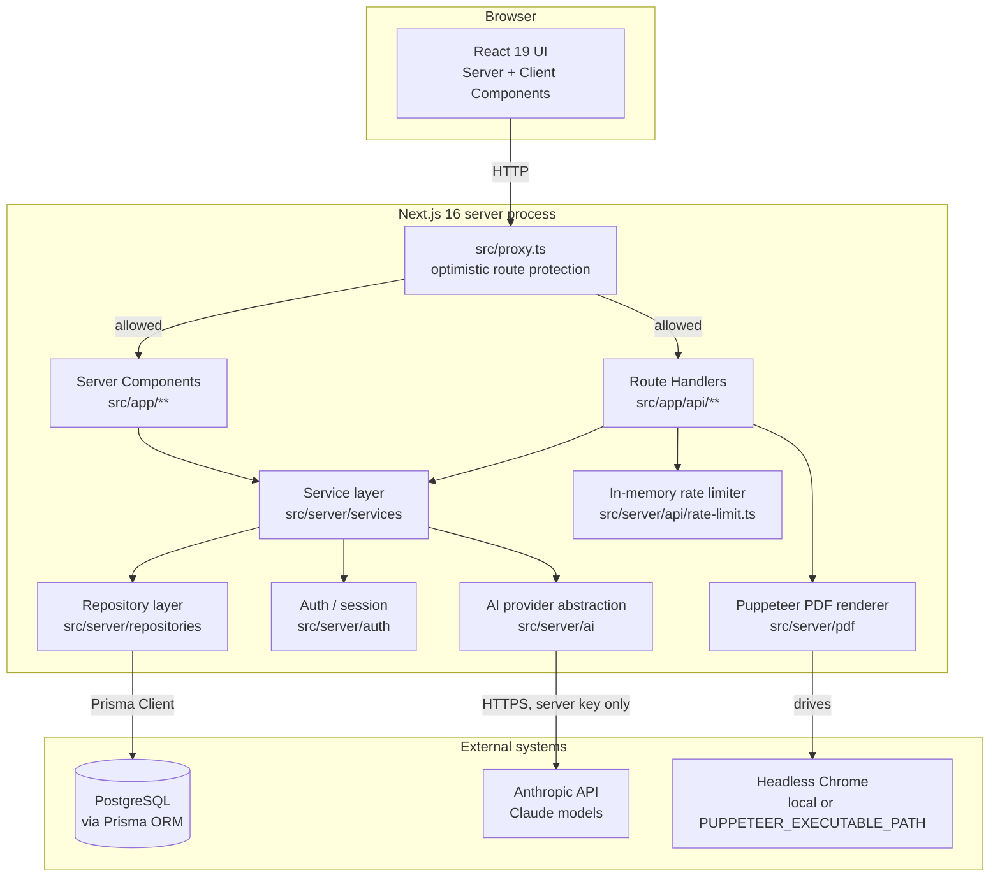

# 13–16, 39. Information Architecture, System Architecture, Technology Stack, Repository Structure, Performance

[← Back to documentation home](README.md)

## 14. System Architecture

The application is a single Next.js 16 (App Router) project. There is no separate backend service — "backend" here means Next.js Route Handlers and Server Components running in the same process as the frontend.



**Frontend.** Next.js App Router, React 19 Server and Client Components, Tailwind CSS 4 + shadcn/ui components (built on Base UI primitives). Client Components are used only where interactivity is required (forms, the wizard, the admin CRUD UI); most pages are Server Components that fetch data directly through the service layer.

**Backend.** Next.js Route Handlers under `src/app/api/**`, and Server Components that call the service layer directly for reads. There is a strict layering convention: **route/page → service → repository → Prisma**. Routes never query the database directly.

**Database.** PostgreSQL, accessed exclusively through Prisma ORM (no raw SQL anywhere in the codebase).

**Authentication.** A custom, dependency-light implementation (not a third-party auth library) — see [10-security-and-privacy.md](10-security-and-privacy.md).

**Validation.** Zod schemas at every input boundary (`src/lib/validation/*.ts`), enforced server-side in every route/service, independent of whatever client-side validation the form also does.

**Storage.** No file/object storage is used or configured — the application has no user file uploads. The only generated binary artefact (a planner PDF) is streamed directly in the HTTP response, never persisted to disk or a bucket.

**AI integration.** A provider-abstraction pattern (`AIProvider` interface) so the app never talks to a vendor SDK directly outside `src/server/ai/providers/*` — see [09-ai-architecture.md](09-ai-architecture.md).

**Export system.** Puppeteer-driven headless Chrome renders the same print page a browser would show, then returns the resulting PDF bytes — there is no separate templating/export engine.

**Deployment.** Not configured — see [13-deployment-guide.md](13-deployment-guide.md).

**External services.** Anthropic's Claude API (optional — the app runs fully with AI disabled) and a local/system Chrome/Chromium binary for PDF rendering.

### Actual vs planned architecture

Authentication is implemented with a custom session system (JWT cookies via `jose` + `bcryptjs`), **not** a third-party library such as NextAuth/Auth.js. (An earlier version of the root `README.md`, predating most of this codebase, described the project as unstarted scaffolding and said authentication "will be added ... via NextAuth/Auth.js" — that statement no longer reflected the repository and has been corrected as part of producing this documentation set; see [17-project-status.md](17-project-status.md#technical-debt).)

---

## 15. Technology Stack

Versions below are the exact resolved versions from `package-lock.json`, not the semver ranges in `package.json`.

| Technology | Version | Purpose | Why/How Used | Status |
|---|---|---|---|---|
| Next.js | 16.3.5 | Full-stack React framework (App Router, Turbopack) | Pages, Route Handlers, Server Components, `proxy.ts` for optimistic route protection | IMPLEMENTED |
| React | 19.2.8 | UI library | Server + Client Components throughout | IMPLEMENTED |
| TypeScript | 5.9.3 | Static typing | Strict mode across the whole codebase; `tsc --noEmit` is part of the verification workflow | IMPLEMENTED |
| Tailwind CSS | 4.3.3 | Utility-first CSS | All styling, including print-specific (`print:`) variants | IMPLEMENTED |
| shadcn/ui (`components.json`, style `base-nova`) | shadcn CLI 4.21.0 | UI component scaffolding | Generates local, owned component files in `src/components/ui` built on Base UI primitives | IMPLEMENTED |
| @base-ui/react | 1.8.0 | Headless UI primitives | Underlies Select, Dialog/Sheet, Dropdown Menu components | IMPLEMENTED |
| lucide-react | 1.46.0 | Icon set | All icons in the app | IMPLEMENTED |
| PostgreSQL | 18 (dev, via `embedded-postgres`) | Relational database | Sole datasource; any Prisma-compatible Postgres version is expected to work in other environments | IMPLEMENTED |
| Prisma (`@prisma/client` + `prisma`) | 6.19.3 | ORM, migrations, seeding | Schema-first models, typed client, `prisma migrate`, `prisma db seed` | IMPLEMENTED |
| Zod | 4.6.5 | Schema validation | Every API input boundary, and AI output validation | IMPLEMENTED |
| jose | 6.2.12 | JWT signing/verification | Session cookie tokens (HS256) | IMPLEMENTED |
| bcryptjs | 3.0.3 | Password hashing | Cost factor 12, used for both account passwords and (implicitly, via the same hashing utility) nothing else sensitive | IMPLEMENTED |
| @anthropic-ai/sdk | 0.126.0 | Anthropic Claude API client | The only implemented `AIProvider`; used only inside `anthropic-ai-provider.ts` | IMPLEMENTED |
| puppeteer-core | 25.11.0 | Headless Chrome automation | Drives a locally-installed Chrome/Chromium to render a planner to PDF | IMPLEMENTED |
| embedded-postgres | 18.4.0-beta.17 | Zero-install local PostgreSQL | Development convenience only (`npm run db:local`), not used in production | IMPLEMENTED (dev-only) |
| ESLint (`eslint-config-next`) | 9 / 16.3.5 | Linting | `next/core-web-vitals` + `next/typescript` rule sets | IMPLEMENTED |
| tsx | 4.23.13 | TypeScript execution | Runs the seed script and every `scripts/*.ts` test/utility script | IMPLEMENTED |

---

## 13. Information Architecture

### Main navigation

The desktop sidebar / mobile drawer render a single shared list (`NAV_ITEMS` in `src/lib/constants/navigation.ts`): Dashboard, Create Planner, My Planners, Curriculum, Classes, Resources, Assessments, Settings. An additional "Admin" item is appended **only** for a signed-in `CURRICULUM_ADMIN` account (a teacher's rendered navigation and its underlying code path are unchanged either way).

### Route table

Auth column: **None** = usable without a session; **Teacher** = any signed-in user (the route itself doesn't distinguish role beyond requiring a session); **Admin** = `CURRICULUM_ADMIN` role required, enforced in the service layer independent of the route.

#### Pages

| Route | Role | Auth Required | Status |
|---|---|---|---|
| `/` | Any | None | NOT IMPLEMENTED (placeholder) |
| `/login` | Any | None (redirects away if already signed in) | IMPLEMENTED |
| `/register` | Any | None (redirects away if already signed in) | IMPLEMENTED |
| `/forgot-password` | Any | None | IMPLEMENTED |
| `/reset-password?token=` | Any | None (token-based) | IMPLEMENTED |
| `/dashboard` | Teacher | Required | IMPLEMENTED |
| `/planners/new` (also used for editing, via `?draftId=`, and for prefill, via `?indicatorId=`) | Teacher | Required | IMPLEMENTED |
| `/planners` | Teacher | Required | NOT IMPLEMENTED (placeholder) |
| `/planners/[plannerId]` | Teacher | Required | NOT IMPLEMENTED (placeholder) |
| `/planners/[plannerId]/lessons/[lessonId]` | Teacher (owner only) | Required | IMPLEMENTED |
| `/planners/[plannerId]/print` | Teacher (owner only) | Required | IMPLEMENTED |
| `/curriculum` | Teacher | Required | NOT IMPLEMENTED (placeholder) |
| `/curriculum/[subjectId]/[formId]` | Teacher | Required | NOT IMPLEMENTED (placeholder) |
| `/classes` | Teacher | Required | NOT IMPLEMENTED (placeholder) |
| `/resources` | Teacher | Required | NOT IMPLEMENTED (placeholder) |
| `/assessments` | Teacher | Required | NOT IMPLEMENTED (placeholder) |
| `/settings/profile` | Teacher | Required | IMPLEMENTED |
| `/admin/curriculum` | Admin | Required | IMPLEMENTED |
| `/admin/curriculum/subjects` | Admin | Required | IMPLEMENTED |
| `/admin/curriculum/class-levels` | Admin | Required | IMPLEMENTED |
| `/admin/curriculum/versions` | Admin | Required | IMPLEMENTED |
| `/admin/curriculum/tree` | Admin | Required | IMPLEMENTED |
| `/admin/curriculum/import` | Admin | Required | IMPLEMENTED |

#### API routes

| Route | Methods | Role | Auth Required | Status |
|---|---|---|---|---|
| `/api/auth/login` | POST | Any | None (rate-limited) | IMPLEMENTED |
| `/api/auth/register` | POST | Any | None (rate-limited) | IMPLEMENTED |
| `/api/auth/logout` | POST | Any | None | IMPLEMENTED |
| `/api/auth/forgot-password` | POST | Any | None (rate-limited) | IMPLEMENTED |
| `/api/auth/reset-password` | POST | Any | None (token-based) | IMPLEMENTED |
| `/api/profile` | GET, PATCH | Teacher | Required | IMPLEMENTED |
| `/api/planners` | POST | Teacher | Required | IMPLEMENTED |
| `/api/planners/[id]` | GET, PATCH | Teacher (owner only) | Required | IMPLEMENTED |
| `/api/planners/[id]/publish` | POST | Teacher (owner only) | Required | IMPLEMENTED |
| `/api/planners/[id]/pdf` | GET | Teacher (owner only) | Required | IMPLEMENTED |
| `/api/planners/[id]/reflectable-lessons` | GET | Teacher (owner only) | Required | IMPLEMENTED |
| `/api/planners/[id]/lessons/[lessonId]/reflection` | GET, PATCH | Teacher (owner only) | Required | IMPLEMENTED |
| `/api/planners/[id]/ai/[action]` | POST | Teacher (owner only) | Required (rate-limited) | IMPLEMENTED |
| `/api/curriculum/subjects` | GET | Any | **None (deliberately public** — used by the pre-auth registration form) | IMPLEMENTED |
| `/api/curriculum/class-levels/all` | GET | Any | **None (deliberately public**, same reason) | IMPLEMENTED |
| `/api/curriculum/class-levels` | GET | Teacher | Required | IMPLEMENTED |
| `/api/curriculum/strands` | GET | Teacher | Required | IMPLEMENTED |
| `/api/curriculum/sub-strands` | GET | Teacher | Required | IMPLEMENTED |
| `/api/curriculum/content-standards` | GET | Teacher | Required | IMPLEMENTED |
| `/api/curriculum/learning-outcomes` | GET | Teacher | Required | IMPLEMENTED |
| `/api/curriculum/learning-indicators` | GET | Teacher | Required | IMPLEMENTED |
| `/api/curriculum/learning-indicators/[id]/path` | GET | Teacher | Required | IMPLEMENTED |
| `/api/cross-cutting-themes` | GET | Teacher | Required | IMPLEMENTED |
| `/api/admin/curriculum/subjects` | GET, POST | Admin | Required (service-layer) | IMPLEMENTED |
| `/api/admin/curriculum/subjects/[id]` | PATCH, DELETE | Admin | Required (service-layer) | IMPLEMENTED |
| `/api/admin/curriculum/class-levels` | GET, POST | Admin | Required (service-layer) | IMPLEMENTED |
| `/api/admin/curriculum/class-levels/[id]` | PATCH, DELETE | Admin | Required (service-layer) | IMPLEMENTED |
| `/api/admin/curriculum/versions` | GET, POST | Admin | Required (service-layer) | IMPLEMENTED |
| `/api/admin/curriculum/versions/[id]` | PATCH, DELETE | Admin | Required (service-layer) | IMPLEMENTED |
| `/api/admin/curriculum/strands` | GET, POST | Admin | Required (service-layer) | IMPLEMENTED |
| `/api/admin/curriculum/strands/[id]` | PATCH, DELETE | Admin | Required (service-layer) | IMPLEMENTED |
| `/api/admin/curriculum/sub-strands` | GET, POST | Admin | Required (service-layer) | IMPLEMENTED |
| `/api/admin/curriculum/sub-strands/[id]` | PATCH, DELETE | Admin | Required (service-layer) | IMPLEMENTED |
| `/api/admin/curriculum/content-standards` | GET, POST | Admin | Required (service-layer) | IMPLEMENTED |
| `/api/admin/curriculum/content-standards/[id]` | PATCH, DELETE | Admin | Required (service-layer) | IMPLEMENTED |
| `/api/admin/curriculum/learning-outcomes` | GET, POST | Admin | Required (service-layer) | IMPLEMENTED |
| `/api/admin/curriculum/learning-outcomes/[id]` | PATCH, DELETE | Admin | Required (service-layer) | IMPLEMENTED |
| `/api/admin/curriculum/learning-indicators` | GET, POST | Admin | Required (service-layer) | IMPLEMENTED |
| `/api/admin/curriculum/learning-indicators/[id]` | PATCH, DELETE | Admin | Required (service-layer) | IMPLEMENTED |
| `/api/admin/curriculum/import/preview` | POST | Admin | Required (service-layer) | IMPLEMENTED |
| `/api/admin/curriculum/import/commit` | POST | Admin | Required (service-layer) | IMPLEMENTED |

**Protected routes:** every path in `PROTECTED_PREFIXES` (`/dashboard`, `/planners`, `/curriculum`, `/classes`, `/resources`, `/assessments`, `/settings`, `/admin`) is gated optimistically by `src/proxy.ts` (cookie presence/signature check only, no database call, no role check) and then re-checked properly, with a real database-backed identity/role lookup, inside the page layout or API route itself. `proxy.ts` explicitly does not check role — `/admin` protection against a signed-in teacher happens entirely in the `(admin)` layout and in `requireAdminSession()`.

**Administrator routes:** every `/admin/*` page and every `/api/admin/*` route. Note that none of the `/api/admin/curriculum/*` route files contain visible auth code themselves — the check lives one layer down, inside every exported function of `curriculum-admin.service.ts`, so the protection holds even if a future route were added without remembering to add a check at the route layer.

---

## 16. Repository Structure

```
prisma/
  schema.prisma            Single source of truth for the database schema
  migrations/               7 applied migrations (see 07-database-design.md)
  seed.ts                   Entry point for `npm run db:seed`
  seed-data/                 Hand-authored seed content (Computing/Form 1, cross-cutting
                              themes, demo teacher, demo admin)
  seed/                       Idempotent import functions used by seed.ts and by the
                              curriculum-import pipeline

src/
  app/                       Next.js App Router
    (marketing)/              Public landing page (placeholder)
    (auth)/                    Login / register / forgot / reset password
    (app)/                     Authenticated teacher area (dashboard, planners, settings)
    (admin)/                   Curriculum administration area
    api/                       Route Handlers, mirroring the route table above
  components/
    ui/                        shadcn/ui primitives (owned, editable local copies)
    admin/                     Admin CRUD/tree/import UI
    auth/                      Login/Register/ForgotPassword/ResetPassword/Profile forms
    curriculum/                Cascading curriculum selector
    dashboard/                 Stat cards, recent planners, upcoming lessons
    layout/                    App shell, sidebar, header, breadcrumbs, user menu
    planner/                   Wizard (steps, AI panels, list editors) and print document
  server/                    Server-only code (never imported by a Client Component)
    ai/                        AIProvider interface, factory, and provider implementations
    api/                       Small route helpers (query parsing, rate limiting)
    auth/                      Session (JWT), password hashing, RBAC helpers
    db/                        Prisma client singleton
    email/                     Email provider abstraction (console-log implementation only)
    errors/                    Typed AppError hierarchy + route error mapping
    pdf/                       Puppeteer PDF rendering + Chrome executable discovery
    repositories/              Data-access layer (Prisma queries only, no business rules)
    services/                  Business logic layer (validation, authorization, orchestration)
      curriculum-import/        The CSV/JSON import pipeline (parse/validate/diff/commit)
  lib/                       Shared client+server utilities
    validation/                 Zod schemas, one file per domain area
    constants/                  Navigation items, wizard step metadata
    env.ts                      Validated environment variables
  hooks/                     Client-side React hooks (autosave, unsaved-changes warning,
                              curriculum option fetching)
  types/                     Present but effectively empty (`export {}` placeholder — never
                              populated; see 17-project-status.md)
  proxy.ts                   Optimistic route-protection middleware equivalent

scripts/                   Standalone TypeScript utilities run via `tsx`
  local-postgres.ts          Starts the zero-install dev database
  test-*.ts                   11 end-to-end test scripts (see 11-testing-strategy.md)
  _lib/                       Shared test helpers (authenticated HTTP session wrapper)
  print-curriculum-tree.ts    Debug utility to dump the seeded curriculum tree

docs/                      This documentation set, plus the reference document
  lesson plan.docx           The Ghanaian sample Learning Planner used as the design source
```

Generated/ignored directories (`node_modules`, `.next`, `.pgdata`, build artefacts) are intentionally not documented here.

---

## 39. Performance Considerations

| Area | Current state |
|---|---|
| Database queries | Curriculum cascade lookups are simple, indexed, parent-scoped queries. The curriculum-import preview's DB-diff step queries once per node in a loop (not batched) — acceptable at current admin-import volumes, a candidate for batching if import files grow much larger. |
| Indexes | Foreign-key columns used in `WHERE` clauses (`teacherId`, `learningIndicatorId`, `plannerId`, `lessonId`, `subjectId`/`classLevelId`/`curriculumVersionId` on `Strand`, etc.) all have explicit `@@index` declarations in the schema — see [07-database-design.md](07-database-design.md). |
| Caching | No application-level caching layer (no Redis, no in-memory query cache) exists. `getCurrentUser()` is memoized per-request only (via React `cache()`), not across requests. |
| Server vs client rendering | Most pages are React Server Components that fetch through the service layer directly (no client-side round trip for initial data); the wizard, admin CRUD UI, and AI panels are Client Components where interactivity requires it. |
| AI calls | Each AI action is a single request to the Anthropic API with a forced tool call and a 60-second timeout; results are not cached, so identical requests are re-generated each time (this is intentional — "Regenerate" is expected to produce a different suggestion). |
| PDF generation | A new headless Chrome instance is launched per PDF export request (no browser pooling/reuse). Confirmed acceptable for this application's expected usage in manual testing (multi-page PDFs render correctly, typical export time is a few seconds); would become a bottleneck under high concurrent export volume. |
| Large curriculum datasets | Only tested against a small seeded dataset (13 learning indicators). Admin list views (`listSubjects`, `listStrands`, etc.) use unbounded `findMany` queries with no pagination — acceptable at realistic curriculum-admin volumes (tens to low hundreds of rows per level), untested at larger scale. |
| Pagination | Not implemented anywhere in the application. |
| Search | Not implemented anywhere in the application (there is no planner search, as the "My Planners" list itself does not exist yet). |

No formal performance budget, load test, or profiling has been carried out against this codebase; the statements above are based on code inspection and the manual/automated testing performed during development, not on production telemetry.
