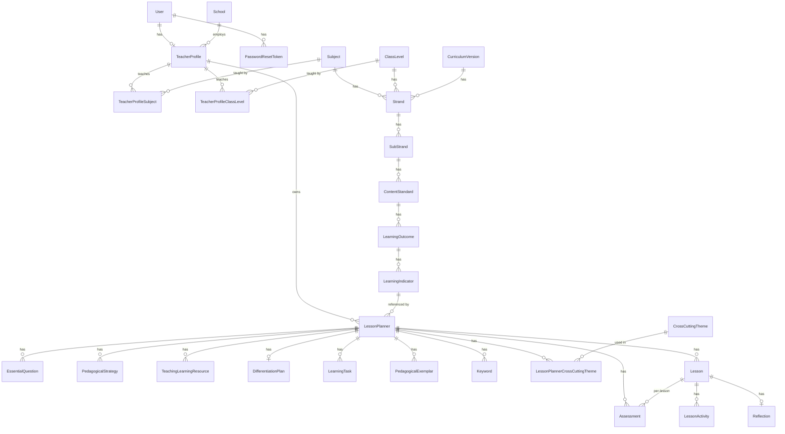

# 17–18. Database Architecture and Data Dictionary

[← Back to documentation home](README.md)

Source of truth: `prisma/schema.prisma`. PostgreSQL via Prisma ORM 6.19.3. All ids are CUIDs (`@default(cuid())`). Table names in the actual database are snake_case (via `@@map`); model names below are the Prisma/TypeScript names.

## 17. Database Architecture

### Entity-relationship diagram

### Two clearly separated regions

1. **Curriculum master data** — `CurriculumVersion`, `Subject`, `ClassLevel`, `Strand`, `SubStrand`, `ContentStandard`, `LearningOutcome`, `LearningIndicator`. Admin-managed, versioned, and only ever *referenced* by lesson planners, never duplicated.
2. **Teacher-authored planning data** — `LessonPlanner` and everything beneath it. Fully owned and editable per teacher, independent of the curriculum master data it references by id.

### Models

#### `User`
Identity and credentials for both teachers and admins.
- **PK:** `id`
- **Fields:** `name`, `email` (unique), `passwordHash`, `role` (`TEACHER` default | `CURRICULUM_ADMIN`), `createdAt`, `updatedAt`
- **Relationships:** 1:0..1 with `TeacherProfile`; 1:N with `PasswordResetToken`
- Not every `User` has a `TeacherProfile` — an admin account does not need one.

#### `PasswordResetToken`
Single-use, time-limited password-reset token.
- **PK:** `id`; **FK:** `userId → User.id` (`onDelete: Cascade`)
- **Fields:** `tokenHash` (unique — only a SHA-256 hash is stored, never the raw token), `expiresAt`, `usedAt` (nullable), `createdAt`
- **Index:** `[userId]`

#### `School`
- **PK:** `id`
- **Fields:** `name`, `district` (nullable), `region` (nullable), `createdAt`
- **Relationships:** 1:N with `TeacherProfile`

#### `TeacherProfile`
- **PK:** `id`; **FK:** `userId → User.id` (unique, `onDelete: Cascade`), `schoolId → School.id` (nullable, `onDelete: SetNull`)
- **Fields:** `staffId` (nullable — "Teacher ID"), `region` (nullable, independent of the school's own region), `createdAt`, `updatedAt`
- **Relationships:** N:M with `Subject` via `TeacherProfileSubject`; N:M with `ClassLevel` via `TeacherProfileClassLevel`; 1:N with `LessonPlanner`
- **Index:** `[schoolId]`

#### `TeacherProfileSubject` / `TeacherProfileClassLevel`
Join tables recording which subjects/classes a teacher teaches — reused references to curriculum master data, never duplicated text.
- **Composite PK:** `[teacherProfileId, subjectId]` / `[teacherProfileId, classLevelId]`
- **FKs:** `teacherProfileId → TeacherProfile.id` (`Cascade`); `subjectId → Subject.id` / `classLevelId → ClassLevel.id` (`Restrict` — a subject/class level in use by a teacher profile cannot be deleted)

#### `CurriculumVersion`
- **PK:** `id`
- **Fields:** `name` (unique), `year` (nullable), `status` (`DRAFT` default | `ACTIVE` | `ARCHIVED`), `createdAt`
- **Relationships:** 1:N with `Strand`

#### `Subject`
- **PK:** `id`
- **Fields:** `name` (unique), `code` (unique), `createdAt`
- **Relationships:** 1:N with `Strand`; N:M with `TeacherProfile`

#### `ClassLevel`
- **PK:** `id`
- **Fields:** `name` (unique), `sequence` (unique — ordering)
- **Relationships:** 1:N with `Strand`; N:M with `TeacherProfile`

#### `Strand`
- **PK:** `id`; **FKs:** `subjectId`, `classLevelId`, `curriculumVersionId` (all `onDelete: Restrict`)
- **Fields:** `name`, `code` (nullable, **unique**), `sequence`, `createdAt`, `updatedAt`
- **Relationships:** 1:N with `SubStrand`
- **Index:** `[subjectId, classLevelId, curriculumVersionId]`

#### `SubStrand`
- **PK:** `id`; **FK:** `strandId` (`onDelete: Cascade`)
- **Fields:** `name`, `code` (nullable, **unique**), `sequence`, `createdAt`, `updatedAt`
- **Relationships:** 1:N with `ContentStandard`
- **Index:** `[strandId]`

#### `ContentStandard`
- **PK:** `id`; **FK:** `subStrandId` (`onDelete: Cascade`)
- **Fields:** `code` (nullable, **unique**), `description`, `sequence`, `createdAt`, `updatedAt`
- **Relationships:** 1:N with `LearningOutcome`
- **Index:** `[subStrandId]`

#### `LearningOutcome`
- **PK:** `id`; **FK:** `contentStandardId` (`onDelete: Cascade`)
- **Fields:** `description`, `sequence`, `createdAt`, `updatedAt` — **no `code` field**; identity is parent + `sequence`.
- **Relationships:** 1:N with `LearningIndicator`
- **Index:** `[contentStandardId]`

#### `LearningIndicator`
- **PK:** `id`; **FK:** `learningOutcomeId` (`onDelete: Cascade`)
- **Fields:** `code` (nullable, **unique**), `description`, `sequence`, `createdAt`, `updatedAt`
- **Relationships:** 1:N with `LessonPlanner` (the reverse reference — see below)
- **Index:** `[learningOutcomeId]`

#### `CrossCuttingTheme`
Controlled vocabulary, not part of the Subject→Indicator hierarchy.
- **PK:** `id`
- **Fields:** `name` (unique), `description` (nullable)
- **Relationships:** N:M with `LessonPlanner` via `LessonPlannerCrossCuttingTheme`

#### `LessonPlanner`
The teacher-authored planner. Most fields are nullable to support incremental autosave; full completeness is enforced by the service layer at publish time, not by the schema.
- **PK:** `id`; **FKs:** `teacherId → TeacherProfile.id` (`Restrict`), `learningIndicatorId → LearningIndicator.id` (nullable, `Restrict`)
- **Fields:** `academicYear`, `term` (nullable enum `TERM_1`|`TERM_2`|`TERM_3`), `weekNumber` (nullable), `durationMinutes` (nullable), `classSection` (nullable), `status` (`DRAFT` default | `PUBLISHED`), `createdAt`, `updatedAt`
- **Relationships:** 1:N with `EssentialQuestion`, `PedagogicalStrategy`, `TeachingLearningResource`, `LearningTask`, `PedagogicalExemplar`, `Keyword`, `Assessment`, `LessonPlannerCrossCuttingTheme`, `Lesson`; 1:0..1 with `DifferentiationPlan`
- **Indexes:** `[teacherId]`, `[learningIndicatorId]`
- **Ownership:** every read/write of a `LessonPlanner` (and everything beneath it) is scoped by `teacherId` at the repository layer — this is the entire ownership-enforcement mechanism.

#### `LessonPlannerCrossCuttingTheme`
- **Composite PK:** `[plannerId, themeId]`
- **FKs:** `plannerId → LessonPlanner.id` (`Cascade`), `themeId → CrossCuttingTheme.id` (`Restrict`)
- **Fields:** `explanation` (nullable text) — how this theme is incorporated into this specific lesson; a selection without an explanation is not considered complete by the wizard, though the database itself allows it to be null during a draft.

#### `EssentialQuestion` / `PedagogicalStrategy` / `TeachingLearningResource` / `LearningTask` / `PedagogicalExemplar` / `Keyword`
Six structurally identical list-item tables.
- **PK:** `id`; **FK:** `plannerId → LessonPlanner.id` (`Cascade`)
- **Fields:** `text`, `sequence`
- **Index:** `[plannerId]`

#### `DifferentiationPlan`
One structured plan per planner — deliberately seven separate columns, never a single note.
- **PK:** `plannerId` (also the FK, `onDelete: Cascade` — this is a strict 1:1)
- **Fields (all nullable text):** `mixedAbilityGrouping`, `scaffoldSupport`, `extensionChallenge`, `resourceAdaptation`, `learningTaskDifferentiation`, `teacherPeerSupport`, `additionalNotes`

#### `Assessment`
Supports both a planner-level "Key Assessments (DoK)" summary (`lessonId` null) and a specific per-lesson assessment (`lessonId` set).
- **PK:** `id`; **FKs:** `plannerId → LessonPlanner.id` (`Cascade`), `lessonId → Lesson.id` (nullable, `Cascade`)
- **Fields:** `dokLevel` (enum `LEVEL_1`–`LEVEL_4`), `description`, `sequence`
- **Indexes:** `[plannerId]`, `[lessonId]`

#### `Lesson`
A child of a planner (a planner starts with one auto-created `Lesson`; multi-lesson planners are structurally supported but the wizard as built manages one lesson's Main Lesson/Assessment content per planner).
- **PK:** `id`; **FK:** `plannerId → LessonPlanner.id` (`Cascade`)
- **Fields:** `name`, `sequence`, `date` (nullable), `createdAt`, `updatedAt`
- **Relationships:** 1:N with `LessonActivity`, `Assessment`; 1:0..1 with `Reflection`
- **Index:** `[plannerId]`

#### `LessonActivity`
One row of the staged Main Lesson (Starter/Introductory/Activity/Assessment/Closure).
- **PK:** `id`; **FK:** `lessonId → Lesson.id` (`Cascade`)
- **Fields:** `stage` (enum `STARTER`|`INTRODUCTORY`|`ACTIVITY`|`ASSESSMENT`|`CLOSURE`), `label`, `sequence`, `durationMinutes`, `teacherActivity`, `learnerActivity`
- **Index:** `[lessonId]`

#### `Reflection`
Post-lesson reflection — teacher-only, never AI-written, never automatic. One per lesson; every field nullable so partial saves are always valid.
- **PK:** `id`; **FK:** `lessonId → Lesson.id` (unique, `Cascade`)
- **Fields (all nullable text):** `whatWentWell`, `subgroupsCatered`, `difficulties`, `indicatorsAchieved`, `reteachingNeeded`, `nextLessonChanges`, `remarks`; plus `createdAt`, `updatedAt`

### Cascading behaviour, summarised

| Deleting this... | ...affects | Rule |
|---|---|---|
| `User` | `TeacherProfile`, `PasswordResetToken` | Cascade |
| `TeacherProfile` | `TeacherProfileSubject`, `TeacherProfileClassLevel` | Cascade |
| `TeacherProfile` | `LessonPlanner` | **Restrict** — a teacher profile with any planners cannot be deleted |
| `Subject` / `ClassLevel` | `Strand` | **Restrict** |
| `Subject` / `ClassLevel` | `TeacherProfileSubject` / `TeacherProfileClassLevel` | **Restrict** |
| `CurriculumVersion` | `Strand` | **Restrict** |
| `Strand` | `SubStrand` | Cascade |
| `SubStrand` | `ContentStandard` | Cascade |
| `ContentStandard` | `LearningOutcome` | Cascade |
| `LearningOutcome` | `LearningIndicator` | Cascade |
| `LearningIndicator` | `LessonPlanner` | **Restrict** — a learning indicator referenced by any planner cannot be deleted |
| `CrossCuttingTheme` | `LessonPlannerCrossCuttingTheme` | **Restrict** |
| `LessonPlanner` | everything listed under it above (essential questions, activities, assessments, lessons, etc.) | Cascade |
| `Lesson` | `LessonActivity`, `Assessment` (per-lesson), `Reflection` | Cascade |

The admin service layer additionally pre-checks child counts before allowing a delete of any curriculum node (returning a specific `409 Conflict` message), so in practice the `Cascade` rules on the curriculum side are a database-level safety net that the application itself never actually triggers through normal use.

### Timestamps

Every model that is ever updated after creation has both `createdAt` (`@default(now())`) and `updatedAt` (`@updatedAt`, Prisma-managed). Pure join/list-item tables without their own update lifecycle (`TeacherProfileSubject`, `TeacherProfileClassLevel`, `LessonPlannerCrossCuttingTheme`, `EssentialQuestion`, `PedagogicalStrategy`, `TeachingLearningResource`, `LearningTask`, `PedagogicalExemplar`, `Keyword`, `Assessment`, `LessonActivity`) omit timestamps — these rows are always replaced wholesale (delete-and-recreate) by the planner service on every save, not individually edited in place.

### Migration history

| Migration | Purpose |
|---|---|
| `20260915162944_init_curriculum_and_planner_schema` | Initial curriculum hierarchy + planner schema |
| `20260916062814_planner_draft_support` | Loosened planner fields to nullable for draft/autosave support |
| `20260916085144_add_assessment_activity_stage` | Added `LessonActivityStage` enum / `Assessment.lessonId` |
| `20260916111654_add_differentiation_plan_and_theme_explanation` | Added `DifferentiationPlan` and `LessonPlannerCrossCuttingTheme.explanation` |
| `20260916140902_restructure_reflection_fields` | Restructured `Reflection` to its current 7-field shape |
| `20260916204029_add_auth_and_teacher_profile_fields` | Added `User`, `PasswordResetToken`, and extended `TeacherProfile` (subjects/classes/region) for authentication |
| `20260916221802_add_curriculum_code_unique_constraints` | Added `@unique` to `Strand`/`SubStrand`/`ContentStandard`/`LearningIndicator.code` |

---

## 18. Data Dictionary

Only fields with real constraints/validation beyond "any string" are annotated with an example and rule; every field's type reflects the Prisma schema exactly.

| Entity | Field | Type | Required | Description | Example | Validation / Constraint |
|---|---|---|---|---|---|---|
| User | email | String | Yes | Login identifier | `teacher@example.edu.gh` | Unique; valid email format (Zod `.email()`) |
| User | passwordHash | String | Yes | bcrypt hash, cost 12 | *(hash, never plaintext)* | Never returned by any API |
| User | role | Enum | Yes | `TEACHER` or `CURRICULUM_ADMIN` | `TEACHER` | Defaults to `TEACHER`; no self-service way to become admin |
| PasswordResetToken | tokenHash | String | Yes | SHA-256 hash of the reset token | *(hash only)* | Unique; raw token is never stored |
| PasswordResetToken | expiresAt | DateTime | Yes | Token expiry | — | 1 hour after creation |
| TeacherProfile | staffId | String | No | "Teacher ID" | `DEMO-0001` | Free text, no format enforced |
| TeacherProfile | region | String | No | Teacher's own region (may differ from school) | `Greater Accra` | Free text |
| Subject | code | String | Yes | Short subject identifier | `COMP` | Unique, max 50 chars |
| Subject | name | String | Yes | Full subject name | `Computing` | Unique, max 200 chars |
| ClassLevel | name | String | Yes | Form/grade name | `Form 1` | Unique, max 100 chars |
| ClassLevel | sequence | Int | Yes | Ordering | `1` | Unique, positive integer |
| CurriculumVersion | name | String | Yes | Version label | `2024 Syllabus` | Unique, max 200 chars |
| CurriculumVersion | status | Enum | Yes | `DRAFT`\|`ACTIVE`\|`ARCHIVED` | `DRAFT` | Informational only — not enforced elsewhere (see §10) |
| Strand | code | String | No | Stable identifier, used for import idempotency | `COMP-F1-STR-01` | Unique when present (DB-level) |
| Strand | sequence | Int | Yes | Ordering among sibling strands | `1` | Positive integer |
| SubStrand / ContentStandard / LearningIndicator | code | String | No | Same purpose as `Strand.code` | `COMP-F1-STR-01-SS-01` | Unique when present |
| ContentStandard | description | String | Yes | Content standard text | *(full sentence)* | Max 2000 chars (admin schema) |
| LearningOutcome | description | String | Yes | Outcome text | *(full sentence)* | Max 2000 chars |
| LearningIndicator | description | String | Yes | Indicator text | `Describe data as bit patterns.` | Max 2000 chars |
| LessonPlanner | academicYear | String | Yes | Academic year label | `2025/2026` | Computed by the service layer, not user-entered |
| LessonPlanner | term | Enum | No (until publish) | `TERM_1`\|`TERM_2`\|`TERM_3` | `TERM_1` | Required to publish |
| LessonPlanner | weekNumber | Int | No (until publish) | Week within the term | `3` | 1–52 |
| LessonPlanner | durationMinutes | Int | No (until publish) | Total lesson duration | `240` | 1–600 |
| LessonPlanner | status | Enum | Yes | `DRAFT`\|`PUBLISHED` | `DRAFT` | Set to `PUBLISHED` only by the publish endpoint |
| LessonPlannerCrossCuttingTheme | explanation | Text | No (DB) / expected by wizard | How the theme is incorporated | *(free text)* | Max 1000 chars; step-level validation requires it once a theme is selected |
| EssentialQuestion / PedagogicalStrategy / TeachingLearningResource / LearningTask / PedagogicalExemplar / Keyword | text | String | Yes (per row) | List item content | *(free text)* | Max 1000 chars, max 50 items per list |
| DifferentiationPlan | (each of the 7 fields) | Text | No | One differentiation dimension | *(free text)* | Max 2000 chars each |
| Assessment | dokLevel | Enum | Yes | `LEVEL_1`–`LEVEL_4` | `LEVEL_2` | — |
| Assessment | description | String | Yes | Assessment item text | *(free text)* | Max 2000 chars |
| Lesson | name | String | Yes | Lesson label | `Lesson 1` | Auto-generated on creation |
| LessonActivity | stage | Enum | Yes | `STARTER`\|`INTRODUCTORY`\|`ACTIVITY`\|`ASSESSMENT`\|`CLOSURE` | `STARTER` | A publish requires at least one `CLOSURE` row |
| LessonActivity | label | String | Yes | Short activity title | `Introduce key terms` | Max 120 chars |
| LessonActivity | durationMinutes | Int | Yes | Activity duration | `10` | 1–300 |
| LessonActivity | teacherActivity / learnerActivity | String | Yes | Description of what each party does | *(free text)* | Max 4000 chars each |
| Reflection | (each of the 7 fields) | Text | No | Reflection answer | *(free text)* | Max 4000 chars each |

Full field-level Zod rules (including the difference between the lenient autosave schema and the strict publish schema) are documented in [08-api-documentation.md](08-api-documentation.md#21-validation-rules).
