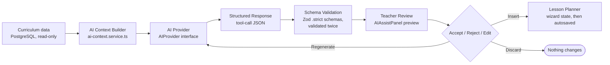

# 23–25. AI Architecture, AI Guardrails, and AI Prompt Architecture

[← Back to documentation home](README.md)

## 23. AI Architecture

### Pipeline

This is the exact pipeline described in the project's core product principle, and it matches the implementation: curriculum data is read from the database, never invented; the AI provider is called only with that read-only context; its response must pass strict schema validation before a teacher ever sees it; the teacher explicitly accepts, edits (by typing further after inserting), or discards it; only an accepted suggestion ever reaches the planner.

### Provider abstraction

`src/server/ai/ai-provider.interface.ts` defines the `AIProvider` contract. Nothing outside `src/server/ai/providers/*` is allowed to depend on a vendor SDK — the rest of the app (services, routes, the wizard) only ever calls through this interface. The doc comment on the interface states the ground rules directly:

> A provider RECEIVES curriculum context; it never receives write access to curriculum data and has no method that could create or alter a Subject/Strand/ContentStandard/LearningOutcome/LearningIndicator. [...] Every return value is a SUGGESTION [...] Nothing a provider returns is persisted directly.

**Implemented providers:**

| Provider | File | Behaviour |
|---|---|---|
| `NoopAIProvider` | `providers/noop-ai-provider.ts` | Always reports itself disabled; every method throws `AIUnavailableError`. This is the default (`AI_PROVIDER=none`), so the application is fully usable with AI completely turned off. |
| `AnthropicAIProvider` | `providers/anthropic-ai-provider.ts` | The one real implementation, backed by `@anthropic-ai/sdk`. Enabled only when `ANTHROPIC_API_KEY` is set. |

**Provider selection:** `getAIProvider()` (`ai-provider.factory.ts`) reads `AI_PROVIDER` from the environment and dynamically `import()`s the matching provider module (never a static import) so an unused provider's SDK is never bundled or loaded. An unrecognised value fails safe to `NoopAIProvider` rather than crashing the app.

**Adding a new vendor** means writing one new file implementing `AIProvider` and adding one `case` to the factory — no other file needs to change.

### Functions

All nine methods below are defined on the `AIProvider` interface and implemented by both providers, called through `src/server/services/ai.service.ts` (never directly):

| Function | Purpose | Reachable from the UI? |
|---|---|---|
| `generateEssentialQuestions()` | Suggests essential questions for the lesson | **Yes** — Wizard Step 3 |
| `generatePedagogicalStrategies()` | Suggests pedagogical strategies | **Yes** — Wizard Step 3 |
| `generateTeachingLearningResources()` | Suggests teaching/learning resources | **Yes** — Wizard Step 3 |
| `generateDifferentiation()` | Suggests a full 7-field differentiation plan | **Yes** — Wizard Step 4 |
| `generatePedagogicalExemplars()` | Suggests pedagogical exemplars | **Yes** — Wizard Step 4 |
| `generateLessonActivities()` | Suggests the main lesson flow (Starter/Introductory/Activity/Assessment stages — never Closure) | **Yes** — Wizard Step 5 |
| `generateAssessments()` | Suggests DoK-leveled assessment items | **Yes** — Wizard Step 6 |
| `generateClosure()` | Suggests a single Closure-stage activity | **Yes** — Wizard Step 5 |
| `generateFullLessonDraft()` | One coherent draft covering all of the above together | **No** — implemented in the interface, both providers, and `ai.service.ts`, but **not mapped in the `/api/planners/[id]/ai/[action]` route's action list and not called by any UI component.** PARTIALLY IMPLEMENTED. |

Each of the eight reachable functions is exposed as one `action` value on `POST /api/planners/[id]/ai/[action]` (see [08-api-documentation.md](08-api-documentation.md)).

### `ai.service.ts` — the mandatory choke point

Every one of the nine functions above is wrapped by a same-named function in `ai.service.ts` that, in order:

1. Loads the planner draft, ownership-checked by `teacherId` exactly like every other planner operation — never accepts curriculum text or ids directly from the request.
2. Requires `learningIndicatorId` and `durationMinutes` to already be set on the draft (`ValidationError` naming which is missing, otherwise).
3. Resolves the provider via the factory; if it isn't enabled, throws `AIUnavailableError` with the provider's own explanation (e.g. "ANTHROPIC_API_KEY is not set").
4. Resolves `AICurriculumContext` fresh from the curriculum database (`ai-context.service.ts`) — see below.
5. Calls the provider method.
6. **Re-validates** the raw response against the matching Zod schema, even though the Anthropic provider has already validated its own output — this is deliberate defense in depth, described in the code as protecting the app "against *any* current or future provider," not redundant with the provider's own check.
7. Returns an `AISuggestionResult<T>` — `{ suggestion, meta: { provider, generatedAt } }` — never the raw provider payload.

### `ai-context.service.ts` — building the read-only context

`buildAICurriculumContext(learningIndicatorId, durationMinutes, teacherId, reflectionSourceLessonId?)`:

- Resolves the full text path (Subject → Learning Indicator, as text, not ids) for the given indicator from `curriculum.repository.ts`. Throws `NotFoundError` for an unknown id.
- `durationMinutes` comes from the planner draft, not the curriculum data.
- If `reflectionSourceLessonId` is supplied, it must resolve to a lesson the **calling teacher owns** (`getReflectionTextForAIContext(teacherId, reflectionSourceLessonId)`); its reflection text is folded in as `previousLessonReflection`, an explicitly optional, separately-labelled field. There is no write path back to that lesson — it is read-only context for a different, new lesson.
- The assembled object is itself validated against `AICurriculumContextSchema` before being handed to a provider, so a provider can never receive a context shape it wasn't designed for.

---

## 24. AI Guardrails

This section states what is a genuine, code-enforced technical control versus what remains a documented design requirement relying on correct future implementation.

| Guardrail | Enforced how | Status |
|---|---|---|
| **AI cannot modify official curriculum data.** | The `AIProvider` interface has no method that writes curriculum data. No AI-facing code path imports `curriculum-admin.service.ts` or any Prisma write to a curriculum table. | **Technically enforced** (structural — there is no method to call, not just a permission check) |
| **AI cannot invent official curriculum standards.** | Every AI output schema (`EssentialQuestionsSuggestionSchema`, etc.) is `.strict()` and contains no field that could hold a curriculum id, strand name, or content-standard text — a provider response that tried to smuggle one in would fail validation. The system prompt additionally instructs the model never to invent/rename/renumber a curriculum standard. | **Technically enforced** at the schema level; **prompt-level instruction** as a secondary layer (a model could still ignore the instruction in prose it isn't asked to produce, but that prose is never captured by the schema and so never reaches the app) |
| **Curriculum context must be supplied by the application.** | `AICurriculumContext` is built exclusively inside `ai-context.service.ts` from database ids the caller supplies — never accepted as free text from a client request body. | **Technically enforced** |
| **AI output must be treated as suggested content.** | Every response is held in `AIAssistPanel`'s local React state until the teacher clicks Insert; nothing is written to wizard state (and therefore nothing is autosaved) automatically. | **Technically enforced** |
| **Teacher remains responsible for reviewing generated content.** | No code path exists to publish a planner without the teacher having interacted with the wizard; there is no "auto-publish AI output" feature. | **Enforced by the absence of any bypass**, not by an explicit review-tracking mechanism (the app does not record whether a teacher actually read a suggestion before inserting it — see Known Limitations in [17-project-status.md](17-project-status.md)) |
| **AI output should be schema-validated before persistence.** | Validated once inside the Anthropic provider (against the same schema forced on the model as a strict tool-call `input_schema`) and again independently in `ai.service.ts`. Malformed output raises `AIInvalidOutputError` and is never returned to the client, let alone saved. | **Technically enforced, twice** |
| **API credentials remain server-side.** | `ANTHROPIC_API_KEY` is read only inside `anthropic-ai-provider.ts`, which begins with `import "server-only"` — a build-time guarantee, not just a convention, that this module cannot be pulled into a client bundle. | **Technically enforced** |
| **Existing teacher content must not be silently overwritten.** | `AIAssistPanel` checks `hasExistingContent`; if true, Insert requires an explicit Append/Replace/Cancel choice before anything is written. | **Technically enforced** |

### What is *not* yet enforced

- There is no persisted flag distinguishing "this text was AI-suggested and inserted" from "this text was typed by the teacher" once content is in the planner — including in the printed/exported PDF. A supervisor reviewing a finished plan cannot currently tell which parts, if any, originated from an AI suggestion. This is a documented gap, not a silent risk introduced by this documentation effort — see [17-project-status.md](17-project-status.md) and [10-security-and-privacy.md](10-security-and-privacy.md).
- There is no rate limit or cost dashboard beyond the request-count throttle described in [10-security-and-privacy.md](10-security-and-privacy.md) — a legitimate teacher can still generate many suggestions in a session; the throttle exists to bound abuse/runaway cost, not to track spend.

---

## 25. AI Prompt Architecture

### System prompt

One fixed system prompt (`SYSTEM_PROMPT` constant in `anthropic-ai-provider.ts`) is sent on every request, regardless of which of the 8 actions is being performed. It establishes, in order: the assistant's role (helping a Ghanaian basic/JHS/SHS teacher plan a single lesson); that curriculum context is read-only and authoritative and must never be invented, renamed, renumbered, or altered; that the model must respond only via the one tool call it's given, with no other commentary; that all output is a suggestion for teacher review, not a final authority; that content should be realistic and age-appropriate for the stated class and proportionate to the stated duration; that it should be written in plain English for a Ghanaian classroom context; and how to treat an optional previous-lesson reflection if one is supplied (informational background about a *different, already-taught* lesson — never an instruction to edit the current one, and never assumed to apply verbatim).

The exact prompt text is in the repository (`src/server/ai/providers/anthropic-ai-provider.ts`) and is not reproduced here in full to avoid this documentation drifting out of sync with the code — treat the source file as authoritative.

### Context construction

Every request's user-message content is built by `formatContextBlock()`, which renders the curriculum context as a labelled block (Subject, Class, Strand, Sub-Strand, Content Standard, Learning Outcome, Learning Indicator, Lesson Duration), explicitly marked "read-only, from the official curriculum database — do not alter", followed — only if the teacher opted in — by the previous lesson's reflection text, delimited with triple-quote fencing and its own explanatory sentence ("The teacher has opted to share their reflection on a previous lesson as background context"). This delimiting is the app's mitigation against the reflection text being misread as an instruction rather than data: it is fenced, labelled, and the system prompt explicitly tells the model how to treat it.

### User inputs

The only values a teacher's own request can influence are: which `action` is requested, an optional `count` (how many items to suggest, 1–20, only meaningful for list-generating actions), and an optional `reflectionSourceLessonId` (validated server-side to belong to the requesting teacher before its *text*, not the id itself, is passed to the model). No other free text from the teacher ever reaches the prompt.

### Structured output

Every method calls Claude with `tool_choice: { type: "tool", name: <toolName> }`, forcing the model to respond only through a single tool call whose `input_schema` is generated directly from the Zod output schema (`z.toJSONSchema(...)`, `strict: true`). This constrains the model's output shape at the API level, on top of (not instead of) the application's own re-validation of whatever comes back.

### Zod / schema validation

Every output schema lives in `src/lib/validation/ai.schema.ts` and deliberately **reuses the exact same field schemas the wizard uses for teacher-typed content** (`LessonActivityInputSchema`, `AssessmentInputSchema`, `DifferentiationPlanSchema`). This is the core enforcement mechanism, in the code's own words: *"An AI response can only ever contain the same shape a teacher could type into the form by hand — no curriculum ids, no extra fields."* Every schema is `.strict()`, so an unexpected extra field fails validation instead of being silently stripped.

### Error recovery

| Failure | Mapped error | Behaviour |
|---|---|---|
| Model declines to respond (`stop_reason: "refusal"`) | `AIInvalidOutputError` | Shown in the panel; teacher can retry |
| Tool call missing from the response | `AIInvalidOutputError` | Includes the actual `stop_reason` for debugging |
| Response fails schema validation | `AIInvalidOutputError` | Never partially trusted or partially applied |
| Request timeout (60s) | `AITimeoutError` | — |
| Network failure | `AIRequestError` | — |
| Anthropic rate limit | `AIRateLimitError` | — |
| Invalid API key | `AIUnavailableError` | Message names the misconfigured environment variable |
| Any other non-2xx | `AIRequestError` | Includes the HTTP status |

No raw SDK error, stack trace, or exception detail ever crosses this boundary — every case above is mapped by `mapAnthropicError()` before the error can propagate further.

### Regeneration

"Regenerate" in `AIAssistPanel` simply re-invokes the same request; there is no seed/variation control, and no memory of prior suggestions within a session — each call is independent.

### Section-level vs full-plan generation

The application's actual, reachable AI workflow is **section-level only** — one action per wizard field/section, matching the 8 actions above. `generateFullLessonDraft` (one call covering essential questions, strategies, a full differentiation plan, the complete lesson flow including Closure, and assessments together) is implemented end-to-end at the backend but is not currently exposed through the API route or any UI control. See [17-project-status.md](17-project-status.md) for this gap and [14-development-roadmap.md](14-development-roadmap.md) for what finishing it would involve.
