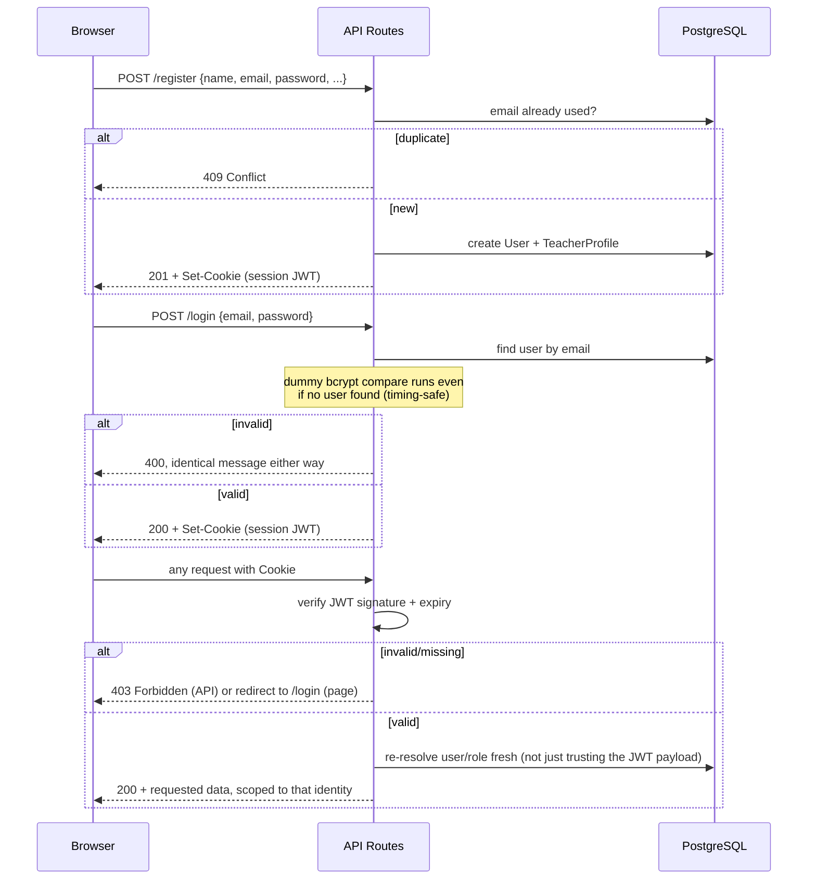

# 22, 26–27. Authentication and Authorization, Security, Privacy and Data Protection

[← Back to documentation home](README.md)

## 22. Authentication and Authorization

### Registration
`POST /api/auth/register` (`auth.service.ts` → `registerTeacher`). Validates via `RegisterSchema`, checks email uniqueness, transactionally creates a `User` (role `TEACHER`) and its `TeacherProfile` (with a school found-or-created by name, and optional subject/class links filtered to real ids), then creates a session. A duplicate email returns a distinct `409 Conflict` — a deliberate, minor account-enumeration tradeoff (a visitor can learn an email is registered), consistent with standard registration-form practice and treated as an accepted risk (see the security risk table below), unlike login/forgot-password, which are engineered specifically to avoid this.

### Login
`POST /api/auth/login`. Returns the **same** error message and status for "no such account" and "wrong password" — verified by an automated test. A dummy bcrypt comparison runs even when no account is found, so the response time doesn't leak which case occurred. Rate-limited (60/IP/5min, 20/email/5min).

### Sessions
A signed JWT (HS256, via `jose`) stored in an httpOnly cookie, `sameSite=lax`, `secure` in production, 7-day expiry. `src/proxy.ts` performs an **optimistic** check (signature + expiry only, no database call — it runs on every matched request including prefetches) purely to redirect an obviously-unauthenticated visitor away from a protected page before the page even renders. It is explicitly *not* the real authorization boundary: every Server Component and Route Handler that needs identity calls `getCurrentUser()`/`getCurrentTeacherId()`, which independently re-verifies the session and re-reads the user's current role/profile from the database — a proxy misconfiguration could never, by itself, expose someone else's data.

### Password handling
bcrypt, cost factor 12 (`bcryptjs`). Passwords are never logged, never returned by any API response, and the reset-token table stores only a SHA-256 hash of the token, never the raw value.

### Protected routes
See the full route table in [06-system-architecture.md](06-system-architecture.md#13-information-architecture). Summary: every `/dashboard`, `/planners`, `/curriculum`, `/classes`, `/resources`, `/assessments`, `/settings`, and `/admin` page is proxy-gated optimistically and layout-gated for real; every API route that touches teacher- or admin-owned data independently checks identity/role again.

### Role-based access
Two roles only: `TEACHER`, `CURRICULUM_ADMIN` (see [01-product-overview.md](01-product-overview.md#5-stakeholders-and-user-roles)). `requireAdminSession()` (throws `403`) and `requireAdmin()` (redirects) are the two role-check helpers; every admin-mutating service function calls the former itself, independent of whichever route happens to call it — verified by an automated test that every one of the 14 admin operations rejects a `TEACHER` account and an unauthenticated caller with `403`.

### Resource ownership
Every planner/lesson/reflection query is scoped by `teacherId` at the repository layer — this scoping *is* the ownership enforcement (there is no separate "ownership check" step to potentially forget). A request for another teacher's planner returns `404`, not `403` or a redacted `200` — confirmed by an automated cross-teacher test — so a teacher can never learn that another teacher's planner id even exists.

### Administrator authorization
Curriculum mutation requires `CURRICULUM_ADMIN`. This is a global role, not scoped to a school or subject — any admin account can edit any curriculum data. There is no per-subject or per-school admin scoping.

---

## 26. Security Documentation

### Summary of controls

| Area | Status |
|---|---|
| Authentication | Custom JWT session, bcrypt cost 12, timing-safe login, no user enumeration on login/forgot-password |
| Authorization | Server-side, defense-in-depth (route + service layer both capable of independently rejecting) |
| IDOR | Every planner/lesson/reflection query filters by owner; cross-owner access returns 404 |
| Input validation | Zod on every route, `.strict()` where extra fields must be rejected |
| XSS | React's default JSX escaping is relied on throughout; no `dangerouslySetInnerHTML` usage was introduced by this codebase's own components |
| CSRF | `sameSite=lax` cookie is the primary mitigation; no separate CSRF token scheme exists |
| SQL injection | Not applicable — Prisma's query builder is used exclusively; no raw SQL anywhere in the codebase |
| Secrets management | `ANTHROPIC_API_KEY` and `SESSION_SECRET` are read only in `server-only`-guarded modules; `.env` is gitignored; `.env.example` contains placeholders only |
| Rate limiting | Implemented for login/register/forgot-password/AI actions — **in-memory, single-process only** (see risk table) |
| Logging | `console.error` for unexpected errors only; no secrets are logged |
| AI prompt injection | Reflection text (the only teacher-supplied free text folded into a prompt) is delimited and labelled as informational background, not instructions |
| File uploads | Curriculum import accepts CSV/JSON text content (max 10 MB), admin-only; there is no general file-upload feature and no binary file handling |

### Security risk table

| Risk | Likelihood | Impact | Current Mitigation | Recommended Mitigation | Status |
|---|---|---|---|---|---|
| Rate limiter is process-local (in-memory `Map`) | Medium (if deployed to multiple instances or serverless) | Medium — limit is effectively multiplied by instance count, weakening brute-force/abuse protection | Documented explicitly in code comments; correct for a single long-running instance | Replace with a shared store (Redis/Upstash) before any multi-instance or serverless deployment | **Open — documented** |
| "My Planners" list, planner detail view, curriculum browser are unbuilt | N/A (not a vulnerability) | Low — a visible nav item leads to a placeholder page | — | Build or remove from nav before a real launch | **Open — see 17-project-status.md** |
| No audit trail on curriculum edits | Low | Low-Medium — cannot answer "who changed this Content Standard and when" | None | Add `createdBy`/`updatedBy` fields if this becomes a real operational need | **Open — not built** |
| No AI-content provenance marking | Low | Low — a reviewer can't tell which text originated from an AI suggestion once inserted | None | Add a per-field or per-planner flag, surfaced in the UI and optionally in print output | **Open — see 09-ai-architecture.md** |
| Registration reveals account existence via a distinct 409 | Low | Low — minor account enumeration via the registration form only (not login/forgot-password) | None (accepted tradeoff, consistent with standard registration UX) | None recommended; flagged for awareness only | **Accepted** |
| No formal penetration test or third-party security review | Unknown | Unknown | Internal code-level security review performed (this document); automated tests cover the ownership/authorization paths described above | Commission an independent security review before handling real student or large-scale teacher data | **Recommended before production** |
| No CSRF token (relies on `sameSite=lax` only) | Low | Low-Medium | `sameSite=lax` blocks the most common cross-site POST vectors | Add explicit CSRF tokens if the app will ever be embedded/iframed or if `sameSite` protection is judged insufficient for the deployment target | **Accepted for now, worth revisiting** |
| No dependency/vulnerability scanning configured (no CI) | Medium | Unknown | None | Add `npm audit`/Dependabot or equivalent once CI exists | **Open — see 13-deployment-guide.md** |
| No formal data-retention or deletion policy | Medium (if real user data is collected) | Medium — relevant to privacy compliance | None | See §27 below | **Open** |

### Data isolation
Enforced by the ownership-scoping described above for teacher data, and by the single global `CURRICULUM_ADMIN` role for curriculum data. There is no multi-tenant/school-level data partition — every teacher account exists in one shared database with no school-scoped isolation boundary beyond each teacher's own planners.

---

## 27. Privacy and Data Protection

**What personal data is collected:** a teacher's name, email address, password (hashed, never stored in plaintext), school name/district/region, an optional "Teacher ID" (staff identifier), an optional personal region, and the subjects/classes they teach. No pupil/learner personal data is collected by the schema — lesson planners reference curriculum content and class *sections* (e.g. "Form 1 Gold"), not individual pupils.

**Why it is collected:** required to operate the product as designed — identify the account, tailor the curriculum selectors to what the teacher actually teaches, and personalise the dashboard.

**Where it is stored:** a single PostgreSQL database, self-hosted or provider-hosted depending on deployment (see [13-deployment-guide.md](13-deployment-guide.md)) — no data is stored anywhere else by the application itself.

**Retention considerations:** No automatic data-retention or expiry policy exists. An account and its planners persist indefinitely until manually deleted at the database level — there is no in-app "delete my account" or "delete my planner" feature at all (see [17-project-status.md](17-project-status.md)).

**Deletion considerations:** Deleting a `User` cascades to their `TeacherProfile` and password-reset tokens, but a `TeacherProfile` with any planners cannot itself be deleted (`onDelete: Restrict`) — meaning a real user-initiated account deletion is not currently possible without first manually removing their planners. This is a genuine gap for any future "right to be forgotten" requirement.

**Teacher data:** as listed above. Never shared with the AI provider except as anonymous curriculum context and lesson-planning text — a teacher's name, email, school, or account identifiers are never included in any AI request payload (confirmed by reading `ai-context.service.ts` and `anthropic-ai-provider.ts`: only curriculum text, duration, and optionally a previous lesson's reflection *text* are sent).

**Potential pupil data risks:** the schema has no dedicated field for pupil names or other pupil-identifying data, but nothing technically prevents a teacher from typing pupil-identifying information into a free-text field (e.g. a reflection note, or a lesson activity description) — this would then be treated the same as any other planner content, including potentially being sent to the AI provider if that text is ever used as `previousLessonReflection` context for an AI-assisted lesson. This is a real, currently-unmitigated risk worth flagging explicitly rather than assuming away.

**Data minimisation:** the profile form collects only what the application actually uses (subject/class alignment, school affiliation); no unused or speculative fields exist in the current schema.

**AI provider data flows:** when `AI_PROVIDER=anthropic` is configured, curriculum context text and (optionally) a teacher's own reflection text are sent to Anthropic's API over HTTPS as part of a request. Anthropic's own data handling and retention policies for API requests are external to this codebase and are not represented or guaranteed by anything in this repository — this must be reviewed independently against Anthropic's current terms before relying on it for sensitive content. With the default configuration (`AI_PROVIDER=none`), no data ever leaves the application's own server.

**Compliance statement:** This application makes **no claim of compliance** with any specific data-protection law (e.g. Ghana's Data Protection Act, GDPR, or any other regime) — no such compliance work (privacy policy, lawful-basis assessment, data-processing agreements, breach-notification procedure) is present in this repository. **This is explicitly an area requiring formal legal/privacy review before the application handles real teachers' data at any meaningful scale**, particularly given the account-deletion gap and the AI provider data flow noted above.

---

## Accessibility and Responsive Design

Accessibility (WCAG-aligned review) and responsive-design behaviour are documented together with the testing strategy that verifies them — see [11-testing-strategy.md](11-testing-strategy.md), since both are framed there as "what's implemented vs what remains to be verified" alongside the relevant test categories.
