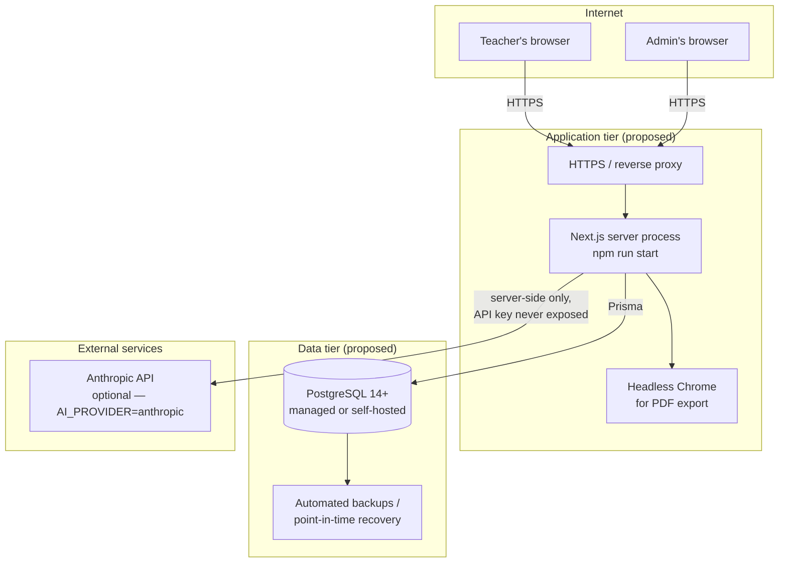

# 41, 43. Development Roadmap and Future Development

[← Back to documentation home](README.md)

## Proposed deployment architecture

This diagram illustrates the deployment shape implied by the application's own requirements (see [13-deployment-guide.md](13-deployment-guide.md)); it is a **proposal**, not a description of an existing environment.

## 41. Development Roadmap

Each phase below reflects work already reflected in the codebase's own structure and history (migrations, test scripts, and the current feature set), extended forward with logical next phases. "Status" is assessed strictly from repository evidence.

### Phase 1 — Foundation
**Objective:** Project scaffolding, tooling, and conventions.
**Deliverables:** Next.js + TypeScript + Tailwind + shadcn/ui project structure; Prisma configured against PostgreSQL; ESLint configuration; layered code convention (route → service → repository).
**Dependencies:** None.
**Completion criteria:** A running `npm run dev` with a clean `tsc`/`lint` pass.
**Status:** COMPLETE.

### Phase 2 — Curriculum Engine
**Objective:** Model and store the official curriculum hierarchy as data.
**Deliverables:** `Subject`/`ClassLevel`/`CurriculumVersion`/`Strand`/`SubStrand`/`ContentStandard`/`LearningOutcome`/`LearningIndicator` schema; seed data transcribed from `docs/lesson plan.docx`; teacher-facing cascading selector API.
**Dependencies:** Phase 1.
**Completion criteria:** A teacher can select a full Strand→Learning Indicator path against real seeded data.
**Status:** COMPLETE (for one subject/class; see Phase 9 for expansion).

### Phase 3 — Core Lesson Planner
**Objective:** Let a teacher build a full planner against the curriculum engine.
**Deliverables:** Authentication (registration/login/session); the 7-step planner wizard with autosave; publish workflow with completeness validation.
**Dependencies:** Phase 2.
**Completion criteria:** A teacher can register, create, edit, and publish a curriculum-aligned planner end to end.
**Status:** COMPLETE.

### Phase 4 — Assessment & Differentiation
**Objective:** Implement the assessment (DoK) and differentiation-specific planner sections.
**Deliverables:** 7-field `DifferentiationPlan`; DoK-leveled `Assessment` model and editor; staged `LessonActivity` model (Starter/Introductory/Activity/Assessment/Closure) replacing an earlier, less granular design.
**Dependencies:** Phase 3.
**Completion criteria:** A published planner includes a complete differentiation plan and at least one DoK-tagged assessment.
**Status:** COMPLETE.

### Phase 5 — AI Assistance
**Objective:** Optional AI-assisted content suggestions, strictly separated from curriculum data.
**Deliverables:** `AIProvider` abstraction; Anthropic implementation; 8 section-level generation actions wired to the wizard; mandatory teacher review (Insert/Append/Replace/Discard); dual schema validation; reflection-as-context opt-in.
**Dependencies:** Phase 3, Phase 4.
**Completion criteria:** A teacher can generate, review, and insert an AI suggestion for each of the 8 exposed sections; the app remains fully usable with AI disabled.
**Status:** MOSTLY COMPLETE — the 8 section-level actions are done; `generateFullLessonDraft` (one-call full-plan generation) is implemented at the backend but not exposed. See "Remaining work" below.

### Phase 6 — Export & Reporting
**Objective:** Reproduce the planner in the national Learning Planner format, on paper and as PDF.
**Deliverables:** Print-styled planner document; browser print action; server-side Puppeteer PDF export with correct pagination for long plans.
**Dependencies:** Phase 3.
**Completion criteria:** A published planner prints and exports to PDF correctly, including multi-page plans.
**Status:** COMPLETE.

### Phase 7 — Administration
**Objective:** Let a `CURRICULUM_ADMIN` maintain curriculum data without editing code.
**Deliverables:** Full CRUD admin UI for all 8 curriculum entities; CSV/JSON bulk import with validation, duplicate detection, and a mandatory preview-before-commit step; server-side authorization enforced independently of the UI.
**Dependencies:** Phase 2.
**Completion criteria:** An admin can build a full curriculum tree by hand or by import, and a teacher account is provably blocked from every admin operation.
**Status:** COMPLETE.

### Phase 8 — Production Hardening
**Objective:** Close the gaps between "works in development" and "safe to run in production."
**Deliverables so far:** Rate limiting on auth and AI endpoints; consistent server-side authorization audit across every route; database-level uniqueness constraints on curriculum codes; a documented security review (see [10-security-and-privacy.md](10-security-and-privacy.md)).
**Remaining work:** deployment configuration (none exists yet); a shared (non-in-memory) rate-limit store if deployed across multiple instances; error/uptime monitoring; a formal privacy/legal review; account-deletion capability; AI-content provenance marking.
**Dependencies:** Phases 1–7.
**Status:** IN PROGRESS.

### Phase 9 — Future Expansion
**Objective:** Grow beyond the current single-subject, single-class, single-teacher-workflow MVP.
**Deliverables (all proposed, none implemented):** additional subjects/class levels; the "My Planners" list/search view and planner detail view; a standalone teacher-facing curriculum browser; planner duplication and deletion; curriculum-version-aware selection (making the existing `DRAFT`/`ACTIVE`/`ARCHIVED` status actually mean something); `generateFullLessonDraft` exposed via the UI; AI-content provenance marking; school-level accounts; collaborative planning; a shared resource library; curriculum coverage and assessment analytics; planner templates; offline capability; a mobile application; school information system integration.
**Dependencies:** Phase 8 substantially complete, ideally with real user feedback from Phases 1–7's feature set first.
**Status:** NOT STARTED.

---

## 43. Future Development

The items below are explicitly **future possibilities**, not commitments, and are not implemented in any form in the current codebase:

- **Additional Ghanaian curriculum subjects.** The data model is already subject-agnostic (see [04-curriculum-architecture.md](04-curriculum-architecture.md)); this is a content/admin task, not an engineering one, once a source document per subject is available.
- **School-level accounts.** Would require a new relationship between `School` and account management (today, `School` is only a descriptive field on a `TeacherProfile`, with no administrative capability attached to it).
- **Collaborative planning.** No concept of shared/co-edited planners exists; `LessonPlanner.teacherId` is a single owner today.
- **Shared resource libraries.** `TeachingLearningResource` rows are currently planner-scoped free text, not a reusable, shared entity.
- **Curriculum coverage analytics.** Would need new aggregation queries (e.g. "which Learning Indicators has this teacher/school not yet planned for") — no such query exists today.
- **Assessment analytics.** Would need to aggregate `Assessment.dokLevel` distributions or outcomes over time — not implemented.
- **Planner templates.** No template/cloning concept exists (see also "planner duplication" in [17-project-status.md](17-project-status.md)).
- **Offline capabilities.** The application assumes a live connection to its own server for every read/write (autosave, curriculum lookups); no offline-first architecture (service worker, local persistence/sync) exists.
- **Mobile application.** Web-only; no native app or React Native codebase exists in this repository.
- **School information system integration.** No integration point (API, webhook, or import format) for an external SIS exists.
- **Teacher collaboration (beyond planning).** E.g. commenting, sharing a planner read-only with a colleague — not implemented.
